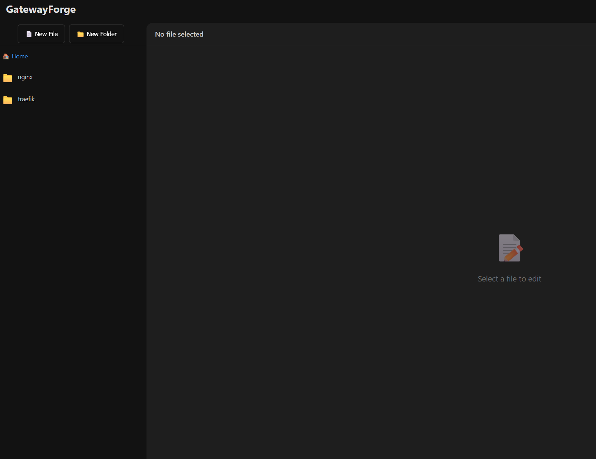

# Nginx UI - Web-based Configuration File Manager

A modern, web-based file explorer and editor specifically designed for managing Nginx and TRAEFIK configuration files. Built with Flask and featuring a beautiful, responsive UI with proper authentication.




> [!WARNING]
> This entire project is vibecoded even this README. Prob isnt the best software to use in prod. Proceed with caution

## Features

- 🔐 **Secure Authentication** - User login system with session management
- 🔒 **Forced Password Change** - Users must change default password on first login
- 🛡️ **Rate Limiting** - Progressive lockout after failed login attempts (3 fails = 5min, 6 fails = 10min, 9+ fails = 30min)
- 📁 **File Explorer** - Browse through nginx and traefik configuration directories
- ✏️ **File Editor** - Edit configuration files with Monaco Editor (VSCode-like)
  - Comprehensive nginx and traefik syntax highlighting
  - Customizable editor settings (font size, minimap, word wrap, tab size)
  - Unsaved changes indicator in file title
  - Browser warning when closing with unsaved changes
- ⌨️ **Customizable Keyboard Shortcuts** - Personalize your workflow
  - Rebind Save, Toggle Comment, and other shortcuts
  - Click input and press your preferred key combination
  - Supports Ctrl, Alt, Shift modifiers
- 💾 **Auto Backup** - Automatic backup creation before file modifications
- 📝 **Activity Logging** - Track all file operations in the database
- ⚙️ **Settings** - Configure nginx and traefik directory path, change username/password
- 🌙 **Dark Mode** - Modern dark theme with professional UI

## Project Structure

```
nginx and traefik-ui/
├── app.py              # Flask application and API endpoints
├── config.py           # Configuration management  
├── static/             # Static assets
│   ├── style.css       # Application styles (dark theme)
│   └── script.js       # Client-side JavaScript
├── templates/          # HTML templates
│   ├── index.html      # Main application page
│   └── login.html      # Login page
├── instance/           # Instance-specific data
│   └── nginx and traefik_ui.db     # SQLite database
└── requirements.txt    # Python dependencies
```

## Installation

1. **Clone or navigate to the project directory:**
   ```bash
   cd ~/projects/nginx and traefik-ui
   ```

2. **Install dependencies:**
   ```bash
   pip install -r requirements.txt
   ```

3. **Run the application:**
   ```bash
   python app.py
   ```

4. **Access the application:**
   Open your browser and navigate to: `http://localhost:5000`

## Default Credentials

- **Username:** admin
- **Password:** admin

🔒 **Security Note:** You will be **required** to change the default password on first login. The application will display a mandatory password change dialog that cannot be dismissed until you set a new password (minimum 8 characters).

### Login Page Features

- **Password Visibility Toggle**: Click the eye icon (👁️) to show/hide your password
  - Eye open (👁️) = password hidden
  - Eye closed (🙈) = password visible
  - Helpful for ensuring you typed the correct password

## Configuration

### Environment Variables

- `SECRET_KEY` - Flask secret key for session management (default: 'dev-secret-key-change-in-production')

### Settings Page

You can configure various settings through the Settings page in the UI:

**Account Settings:**
- Change username (must be unique, minimum 3 characters)
- Change password (requires current password, minimum 8 characters)

**Application Settings:**
- Nginx Configuration Directory
  - Default: `/etc/nginx`
  - Change to any directory you want to manage

**Editor Settings:**
- Font Size (10-24px) - Adjust editor text size
- Show Minimap - Toggle code overview on the right
- Word Wrap - Wrap long lines to fit viewport
- Tab Size (2-8 spaces) - Indentation size
- Settings saved in browser localStorage
- Applied immediately without page reload

**Keyboard Shortcuts:**
- Customize Save File shortcut (default: Ctrl+S)
- Customize Toggle Comment shortcut (default: Ctrl+')
- Click on shortcut input and press your desired key combination
- Supports Ctrl, Alt, Shift modifiers
- Reset to defaults button available
- Changes apply immediately
- Shortcuts saved per-browser in localStorage

## Security Features

- **Password Hashing** - Using Werkzeug's security functions
- **Session-based Authentication** - Secure session management
- **Forced Password Change** - Users must change default password on first login
- **Login Rate Limiting** - Progressive lockout system:
  - 3 failed attempts = 5 minute lockout
  - 6 failed attempts = 10 minute lockout
  - 9+ failed attempts = 30 minute lockout (maximum)
  - Real-time countdown timer on login page
  - Failed attempts cleared on successful login
- **Path Traversal Protection** - Prevents accessing files outside configured directory
- **Activity Logging** - Complete audit trails for all file operations
- **Automatic File Backups** - Before any modifications

## Database Schema

The application uses SQLite with three main tables:

1. **User** - User accounts and authentication
2. **FileEdit** - Activity log for file operations
3. **Config** - Application configuration settings

## File Operations

- **Browse:** Navigate through directories
- **Read:** View file contents with syntax highlighting
- **Write:** Edit and save files
  - Creates automatic backup (`.backup` file)
  - Auto-refreshes file list to show backups and updated sizes
  - Tracks unsaved changes with visual indicator
  - File title shows "(unsaved)" in red when there are unsaved changes
  - Browser warns before closing/refreshing with unsaved work
- **Create:** Create new files and directories
  - Auto-focus on name input when modal opens
  - Press Enter to create (same as clicking "Create" button)
  - Improved workflow for quick file/folder creation
- **Delete:** Remove files and directories
  - Delete button appears on hover for each file/folder
  - Supports deleting folders with all their contents
  - Custom confirmation dialog prevents accidental deletion
  - Different warnings for files vs folders
  - Delete button is auto-focused (press Enter to confirm)
  - Press Escape or click outside to cancel
  - Dark-themed modal matches the UI

## Keyboard Shortcuts

The editor supports the following keyboard shortcuts for improved productivity:

- **Ctrl+S** (Windows/Linux) or **Cmd+S** (Mac) - Save the currently open file
  - Works from anywhere on the page when a file is open
  - Prevents browser's default save dialog
  - Shows notification when no file is open

- **Ctrl+'** (Windows/Linux) or **Cmd+'** (Mac) - Toggle line comment
  - Comments out the current line or selected lines with `#`
  - If lines are already commented, removes the `#`
  - Works on single or multiple selected lines
  - Smart toggle based on current state

- **Ctrl+Click** (Windows/Linux) or **Cmd+Click** (Mac) - Delete file/folder
  - Hold Ctrl/Cmd and click any file or folder in the sidebar to delete it
  - Files and folders turn red when hovering while Ctrl is held
  - Same confirmation dialog as the delete button
  - Quick deletion without needing to hover for the delete button

- **Enter** - Quick submit in modals
  - In Create File/Folder modal: Creates the file/folder
  - In Delete Confirmation modal: Confirms deletion (delete button is auto-focused)
  - Quick workflow without needing to click buttons

- **Escape** - Close delete confirmation modal
  - Press Escape to cancel deletion without clicking Cancel

## API Endpoints

- `POST /login` - User authentication
- `POST /logout` - User logout
- `POST /api/files/list` - List directory contents
- `POST /api/files/read` - Read file content
- `POST /api/files/write` - Write/update file
- `POST /api/files/create` - Create new file/directory
- `POST /api/files/delete` - Delete file/directory
- `GET/POST /api/settings` - Manage application settings
- `GET /api/activity` - View activity logs

## Production Deployment

For production deployment:

1. **Set a secure secret key:**
   ```bash
   export SECRET_KEY='your-very-secure-random-key'
   ```

2. **Use a production WSGI server (e.g., Gunicorn):**
   ```bash
   pip install gunicorn
   gunicorn -w 4 -b 0.0.0.0:5000 app:app
   ```

3. **Set up a reverse proxy (Nginx):**
   ```nginx
   server {
       listen 80;
       server_name your-domain.com;

       location / {
           proxy_pass http://127.0.0.1:5000;
           proxy_set_header Host $host;
           proxy_set_header X-Real-IP $remote_addr;
       }
   }
   ```

4. **Enable HTTPS with SSL certificate**

5. **Change default admin password**

## Development

The application is built with:
- **Backend:** Flask, SQLAlchemy
- **Frontend:** Vanilla JavaScript, CodeMirror
- **Database:** SQLite
- **Styling:** Custom CSS with modern design

## License

MIT License - feel free to use and modify as needed.

## Support

For issues or questions, please create an issue in the repository.

